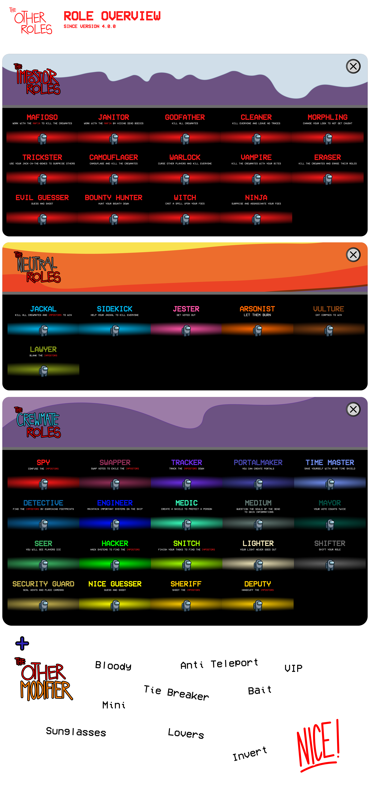

## 快速开始

[](https://github.com/Eisbison/TheOtherRoles)
[](https://fivefirex.github.io/articles/theotherrolesx.html)
[](https://qm.qq.com/cgi-bin/qm/qr?k=n0f-osFS9m9R_tGbQh8BL0pWlN7ryyqj&jump_from=webapi)


欢迎来到TheOtherRolesX！在玩超多职业时遇到任何问题，可以在[GitHub地址](https://github.com/fivefirex/TheOtherRolesX)提交issue。

可参考issue的[提交方法](https://blog.csdn.net/qq_42475711/article/details/105074169)。

最新版v4.0.0下载任选其一：
1. [GitHub](https://github.com/fivefirex/TheOtherRolesX/releases/latest) - 不建议。速度很慢，有ladder用户可以使用。
2. [蓝奏云](https://laoli233.lanzout.com/b00penl2b) - 建议。速度很快，国内用户的不二之选。
3. [CDN](https://github.do/https://raw.githubusercontent.com/fivefirex/assets/master/theotherrolesx/TheOtherRoles.zip) - 不建议。速度可以，但是链接经常挂。
4. [谷歌云](https://drive.google.com/drive/folders/1JRH3KqdC8y8BWc7PGZBVi_qJecODx3y7?usp=sharing) - 建议。更新及时，海外用户首选。

在steam中找到`Among Us`的安装目录，将mod解压到此目录即可。

---

## Credits 超多职业的创作者们

保留一切权利。

### 简体中文翻译

三个汉化组。统称：FFxFc4H。

[FiveFireX汉化组](https://fivefirex.github.io)
- [FiveFireX](https://fivefirex.github.io) - 没错，这个组总共就一个人。还是个懒B（
[风尘汉化工作室](https://www.amonguscn.cn)
- [老李](https://space.bilibili.com/434864305) - 组长兼程序。有着基岩般的后台，因有多年在汉化领域战斗的经验，被称为六边形战士（万能老李好耶
- [大炳鸽](https://space.bilibili.com/321205) - 副组长兼程序兼校对。日语大佬。
- 狸宝 - 程序本体。
- 蘑菇 - 程序MOD管理器。
- [蛋蛋](https://space.bilibili.com/335602215) - 程序，闲杂人等。
- [魂魄小妖夢](https://space.bilibili.com/32238291) - 翻译。英语大佬。
- sxyzhy - 翻译。Debug。
- [源の来如此](https://space.bilibili.com/26361581) - 美工组兼男妈妈。
[四个憨批汉化组](https://www.amongus-cn.tk)
- [茶色](https://space.bilibili.com/438844484) - 组长。
- 旧事 - 设置类文本汉化。
- [凌霄LX](https://space.bilibili.com/29603938) - 职业类文本汉化。
- limulus - 杂项汉化。
- [氢氧则名](https://space.bilibili.com/43878404) - 校对。
- [查尔斯](https://space.bilibili.com/191060324/) - 摸鱼（兼测试？？

### The Other Roles

#### 作者&社区贡献者

[Eisbison](https://github.com/Eisbison)\
[dwd0tcom](https://github.com/dwd0tcom)\
[EoF-1141](https://github.com/EoF-1141)\
[gendelo3](https://github.com/gendelo3)\
[thunderstorm584](https://github.com/thunderstorm584)\
[Mallaris](https://github.com/Mallaris)\
[theonefoster](https://github.com/theonefoster)\
[tomarai](https://github.com/tomarai)\
[gsoneill](https://github.com/gsoneill)\
[Developer626](https://github.com/Developer626)\
[amsyarasyiq](https://github.com/amsyarasyiq)

#### 特别感谢

[OxygenFilter](https://github.com/NuclearPowered/Reactor.OxygenFilter) - v2.3.0 到 v2.6.1 运用的加密算法。\
[Reactor](https://github.com/NuclearPowered/Reactor) - v2.0.0 前的模组框架API。\
[BepInEx](https://github.com/BepInEx) - 与游戏挂钩。\
[Essentials](https://github.com/DorCoMaNdO/Reactor-Essentials) - 游戏自定义选项，作者 **DorCoMaNdO**:
- v1.6 前: 使用普通的 Essentials；
- v1.6-v1.8: 稍微更改了 Essentials，可以在[这里](https://github.com/Eisbison/Reactor-Essentials/tree/feature/TheOtherRoles-Adaption)找到。
- v2.0.0 及以后：感谢**DorCoMaNdO**提供灵感，我们不再使用第三方API，而是自创。

[Jackal and Sidekick](https://www.twitch.tv/dhalucard) - 豺狼和跟班的灵感来源于 **Dhalucard**\
[Among-Us-Love-Couple-Mod](https://github.com/Woodi-dev/Among-Us-Love-Couple-Mod) - 恋人的灵感来源于 **Woodi-dev**\
[Jester](https://github.com/Maartii/Jester) - 小丑的灵感来源于 **Maartii**\
[ExtraRolesAmongUs](https://github.com/NotHunter101/ExtraRolesAmongUs) - 工程师和医生的灵感来源于 **NotHunter101**，使用了一部分源码\
[Among-Us-Sheriff-Mod](https://github.com/Woodi-dev/Among-Us-Sheriff-Mod) - 警长的灵感来源于 **Woodi-dev**\
[TooManyRolesMods](https://github.com/Hardel-DW/TooManyRolesMods) - 侦探和时间之主的灵感来源于 **Hardel-DW**，使用了一部分源码\
[TownOfUs](https://github.com/slushiegoose/Town-Of-Us) - 换票师，交换师，纵火犯和市长的灵感来源于 **Slushiegoose**\
[Ottomated](https://twitter.com/ottomated_) - 变形者，隐蔽者和告密者的灵感来源于 **Ottomated**\
[Crowded-Mod](https://github.com/CrowdedMods/CrowdedMod) - 10+大厅支持来源于 **Crowded Mod Team**\
[Goose-Goose-Duck](https://store.steampowered.com/app/1568590/Goose_Goose_Duck) - 吸血鬼的灵感来源于 **Slushygoose**

---

## 超多职业


<p align="center"><a href="https://github.com/FFxFc/TheOtherRolesX/releases/"></a></p>

<p align="center">
此模组不隶属于 Among Us 或 Innersloth LLC，其中包含的内容未得到 Innersloth LLC 的认可或以其他方式赞助。此处包含的部分内容是Innersloth LLC的财产。© Innersloth LLC.</p>

[](https://discord.gg/77RkMJHWsM)


**超多职业**，是一个[Among Us](https://store.steampowered.com/app/945360/Among_Us)的模组，增加了许多新职业和[设置](#设置)和[自定义帽子](#自定义帽子)。
更多新特性即将到来！ :)

| 内鬼 | 船员 | 中立 | 效果 |
|----------|-------------|-----------------|----------------|
| [教父（黑手党）](#黑手党) | [交换师](#交换师) | [小丑](#小丑) | [溅血者](#溅血者) |
| [小弟（黑手党）](#黑手党) | [市长](#市长) | [纵火犯](#纵火犯) | [通信兵](#通信兵) |
| [清洁工（黑手党）](#黑手党) | [工程师](#工程师) | [豺狼](#豺狼) | [破平者](#破平者) |
| [变形者](#变形者) | [警长](#警长) | [跟班](#跟班) | [诱饵](#诱饵) |
| [隐蔽者](#隐蔽者) | [捕快](#捕快) | [秃鹫](#秃鹫) | [恋人](#恋人) |
| [吸血鬼](#吸血鬼) | [执灯人](#执灯人) | [律师](#律师) | [弱视](#弱视) |
| [抹除者](#抹除者) | [侦探](#侦探) | | [迷你](#迷你) |
| [骗术师](#骗术师) | [时间之主](#时间之主) | | [VIP](#vip) |
| [清洁工](#清洁工) | [医生](#医生) |  | [醉鬼](#醉鬼) |
| [术士](#术士) | [换票师](#换票师) |
| [赏金猎人](#赏金猎人) | [灵媒](#灵媒) |  |
| [女巫](#女巫) | [黑客](#黑客) |  |  |
| [暗杀者](#暗杀者) | [追踪者](#追踪者) |  |  |
| [邪恶的赌怪](#赌怪) | [告密者](#告密者) |  |  |
|  | [卧底](#卧底) |  |  |
|  | [传送师](#传送师) |  |  |
|  | [保安](#保安) |  |  |
|  | [通灵师](#通灵师) |  |  |
|  | [正义的赌怪](#赌怪) |  |

[职业分配](#职业分配)详细的介绍了职业是如何分配的。

### 所有版本

| Among Us版本 | 模组版本 | 下载 |
|----------|-------------|-----------------|
| 2022.3.29s| v4.0.0| [下载1](https://github.com/FFxFc/TheOtherRolesX/releases/download/v4.0.0/TheOtherRoles.zip) [下载2](https://laoli233.lanzout.com/b00penl2b) [下载3](https://github.do/https://raw.githubusercontent.com/fivefirex/assets/master/theotherrolesx/TheOtherRoles.zip) [下载4](https://drive.google.com/drive/folders/1JRH3KqdC8y8BWc7PGZBVi_qJecODx3y7?usp=sharing)
| 2022.3.29s| v3.4.5| [下载](https://github.com/FFxFc/TheOtherRolesX/releases/download/v3.4.5/TheOtherRoles.zip)
| 2022.2.23s| v3.4.4| [下载](https://github.com/FFxFc/TheOtherRolesX/releases/download/v3.4.4/TheOtherRoles.zip)
| ========== | 以下为未汉化的老版 | ========== |
| 2021.12.15s| v3.4.3| [下载](https://github.com/Eisbison/TheOtherRoles/releases/download/v3.4.3/TheOtherRoles.zip)
| 2021.12.15s| v3.4.2| [下载](https://github.com/Eisbison/TheOtherRoles/releases/download/v3.4.2/TheOtherRoles.zip)
| 2021.12.15s| v3.4.1| [下载](https://github.com/Eisbison/TheOtherRoles/releases/download/v3.4.1/TheOtherRoles.zip)
| 2021.12.15s| v3.4.0| [下载](https://github.com/Eisbison/TheOtherRoles/releases/download/v3.4.0/TheOtherRoles.zip)
| 2021.12.15s| v3.3.3| [下载](https://github.com/Eisbison/TheOtherRoles/releases/download/v3.3.3/TheOtherRoles.zip)
| 2021.12.15s| v3.3.2| [下载](https://github.com/Eisbison/TheOtherRoles/releases/download/v3.3.2/TheOtherRoles.zip)
| 2021.12.14s| v3.3.1| [下载](https://github.com/Eisbison/TheOtherRoles/releases/download/v3.3.1/TheOtherRoles.zip)
| 2021.12.14s| v3.3.0| [下载](https://github.com/Eisbison/TheOtherRoles/releases/download/v3.3.0/TheOtherRoles.zip)
| 2021.11.9.5s| v3.2.4| [下载](https://github.com/Eisbison/TheOtherRoles/releases/download/v3.2.4/TheOtherRoles.zip)
| 2021.11.9.5s| v3.2.3| [下载](https://github.com/Eisbison/TheOtherRoles/releases/download/v3.2.3/TheOtherRoles.zip)
| 2021.11.9.5s| v3.2.2| [下载](https://github.com/Eisbison/TheOtherRoles/releases/download/v3.2.2/TheOtherRoles.zip)
| 2021.11.9.5s| v3.2.1| [下载](https://github.com/Eisbison/TheOtherRoles/releases/download/v3.2.1/TheOtherRoles.zip)
| 2021.11.9.5s| v3.2.0| [下载](https://github.com/Eisbison/TheOtherRoles/releases/download/v3.2.0/TheOtherRoles.zip)
| 2021.11.9.5s| v3.1.2| [下载](https://github.com/Eisbison/TheOtherRoles/releases/download/v3.1.2/TheOtherRoles.zip)
| 2021.11.9.5s| v3.1.1| [下载](https://github.com/Eisbison/TheOtherRoles/releases/download/v3.1.1/TheOtherRoles.zip)
| 2021.11.9.5s| v3.1.0| [下载](https://github.com/Eisbison/TheOtherRoles/releases/download/v3.1.0/TheOtherRoles.zip)
| 2021.11.9.5s| v3.0.0| [下载](https://github.com/Eisbison/TheOtherRoles/releases/download/v3.0.0/TheOtherRoles.zip)
| 2021.6.30s| v2.9.2| [下载](https://github.com/Eisbison/TheOtherRoles/releases/download/v2.9.2/TheOtherRoles.zip)
| 2021.6.30s| v2.9.1| [下载](https://github.com/Eisbison/TheOtherRoles/releases/download/v2.9.1/TheOtherRoles.zip)
| 2021.6.30s| v2.9.0| [下载](https://github.com/Eisbison/TheOtherRoles/releases/download/v2.9.0/TheOtherRoles.zip)
| 2021.6.30s| v2.8.1| [下载](https://github.com/Eisbison/TheOtherRoles/releases/download/v2.8.1/TheOtherRoles.zip)
| 2021.6.30s| v2.8.0| [下载](https://github.com/Eisbison/TheOtherRoles/releases/download/v2.8.0/TheOtherRoles.zip)
| 2021.6.30s| v2.7.3| [下载](https://github.com/Eisbison/TheOtherRoles/releases/download/v2.7.3/TheOtherRoles.zip)
| 2021.6.15s| v2.7.1| [下载](https://github.com/Eisbison/TheOtherRoles/releases/download/v2.7.1/TheOtherRoles.zip)
| 2021.6.15s| v2.7.0| [下载](https://github.com/Eisbison/TheOtherRoles/releases/download/v2.7.0/TheOtherRoles.zip)
| 2021.5.25.2s| v2.6.7| [下载](https://github.com/Eisbison/TheOtherRoles/releases/download/v2.6.7/TheOtherRoles.zip)
| 2021.5.10s| v2.6.6| [下载](https://github.com/Eisbison/TheOtherRoles/releases/download/v2.6.6/TheOtherRoles.zip)
| 2021.5.10s| v2.6.5| [下载](https://github.com/Eisbison/TheOtherRoles/releases/download/v2.6.5/TheOtherRoles.zip)
| 2021.5.10s| v2.6.4| [下载](https://github.com/Eisbison/TheOtherRoles/releases/download/v2.6.4/TheOtherRoles.zip)
| 2021.5.10s| v2.6.3| [下载](https://github.com/Eisbison/TheOtherRoles/releases/download/v2.6.3/TheOtherRoles.zip)
| 2021.5.10s| v2.6.2| [下载](https://github.com/Eisbison/TheOtherRoles/releases/download/v2.6.2/TheOtherRoles.zip)
| 2021.4.14s| v2.6.1| [下载](https://github.com/Eisbison/TheOtherRoles/releases/download/v2.6.1/TheOtherRoles.zip)
| 2021.4.14s| v2.6.0| [下载](https://github.com/Eisbison/TheOtherRoles/releases/download/v2.6.0/TheOtherRoles.zip)
| 2021.4.14s| v2.5.1| [下载](https://github.com/Eisbison/TheOtherRoles/releases/download/v2.5.1/TheOtherRoles.zip)
| 2021.4.14s| v2.5.0| [下载](https://github.com/Eisbison/TheOtherRoles/releases/download/v2.5.0/TheOtherRoles.zip)
| 2021.4.14s| v2.4.0| [下载](https://github.com/Eisbison/TheOtherRoles/releases/download/v2.4.0/TheOtherRoles.zip)
| 2021.4.14s| v2.3.0| [下载](https://github.com/Eisbison/TheOtherRoles/releases/download/v2.3.0/TheOtherRoles.zip)
| 2021.4.14s| v2.2.2| [下载](https://github.com/Eisbison/TheOtherRoles/releases/download/v2.2.2/TheOtherRoles.zip)
| 2021.4.12s| v2.2.1| [下载](https://github.com/Eisbison/TheOtherRoles/releases/download/v2.2.1/TheOtherRoles.zip)
| 2021.4.12s| v2.2.0| [下载](https://github.com/Eisbison/TheOtherRoles/releases/download/v2.2.0/TheOtherRoles.zip)
| 2021.3.31.3s| v2.1.0| [下载](https://github.com/Eisbison/TheOtherRoles/releases/download/v2.1.0/TheOtherRoles.zip)
| 2021.3.31.3s| v2.0.1 beta| [下载](https://github.com/Eisbison/TheOtherRoles/releases/download/v2.0.1/TheOtherRoles.zip)
| 2021.3.31.3s | v2.0.0 beta | [下载](https://github.com/Eisbison/TheOtherRoles/releases/download/v2.0.0/TheOtherRoles.zip)
| 2021.3.5s | v1.8.2 | [下载](https://github.com/Eisbison/TheOtherRoles/releases/download/v1.8.2/TheOtherRoles.zip)
| 2021.3.5s | v1.8.1 | [下载](https://github.com/Eisbison/TheOtherRoles/releases/download/v1.8.1/TheOtherRoles.zip)
| 2021.3.5s | v1.8 | [下载](https://github.com/Eisbison/TheOtherRoles/releases/download/v1.8/TheOtherRoles.zip)
| 2021.3.5s | v1.7 | [下载](https://github.com/Eisbison/TheOtherRoles/releases/download/v1.7/TheOtherRoles.zip)
| 2021.3.5s | v1.6 | [下载](https://github.com/Eisbison/TheOtherRoles/releases/download/v1.6/TheOtherRoles.zip)
| 2021.3.5s | v1.5 | [下载](https://github.com/Eisbison/TheOtherRoles/releases/download/v1.5/TheOtherRoles.zip)
| 2021.3.5s | v1.4 | [下载](https://github.com/Eisbison/TheOtherRoles/releases/download/v1.4/TheOtherRoles.zip)
| 2021.3.5s | v1.3 | [下载](https://github.com/Eisbison/TheOtherRoles/releases/download/v1.3/TheOtherRoles.zip)
| 2020.12.19s | v1.1 | [下载](https://github.com/Eisbison/TheOtherRoles/releases/download/v1.1/TheOtherRoles.zip)
| 2020.12.19s | v1.0 | [下载](https://github.com/Eisbison/TheOtherRoles/files/6097191/TheOtherRoles.zip)

### 更新日志
<details>
  <summary>点我查看</summary>

**Version 4.0.0**
- 添加新职业[暗杀者](#暗杀者)，特别感谢[gendelo3](https://github.com/gendelo3)。
- 添加新职业[传送师](#传送师)，特别感谢[gendelo3](https://github.com/gendelo3)。
- 增加了医生护盾可生效一回合的选项。
- 增加了医生护盾立即生效但不会立即显示的选项。
- 给换票师增加特性：换票需要电池，确认换票按钮以及新UI。
- 增加了市长完成若干任务后可看到投票颜色的选项。
- 游客也可以修改名称了。
- 现在在会议里可以查看地图，包含自己最后的位置和任务。
- 增加新效果：诱饵，恋人，迷你，破平者，溅血者，通信兵，弱视和醉鬼。
- 修改了新UI。
- 修复了豺狼招募卧底或内鬼时，即使选项允许，在队友视角还是红名的问题。
- 赌怪选项被移至中立区，但其仍然可以是内鬼或船员。
- 重写了律师逻辑。
- 移除了诱饵，迷你以及恋人职业。
- 修复了尖叫长袍颜色错误的问题。
- 修复了骗术师盒子在Airship上显示不正常的问题。
- 修复了选项“不投票视为自票”不生效的问题。

**Version 3.4.5**
- 适配Among Us v2022.3.29s
- 游戏主页可以开启马模式
- 游戏主页可以进入Discord讨论问题与特性
- 修复了捕快未正常分配的问题
- 修复了捕快晋升警长冷却错误的问题
- 修复了杀手击杀不瞬移的问题
- 更改了熄灯下的资源以弥补原版问题
- 暂时移除了dlekS反转贝壳号 :c 

**Version 3.4.4**
- 修复了在官方服务器上游玩导致闪退的问题。

</details>

### 安装

遇到问题可以加QQ群讨论。

#### Windows
1. 下载并解压缩最新版本模组。
2. 找到游戏的根目录。
3. 拷贝一份游戏，并重命名他，不要有中文路径。虽然不是必须的，但我们非常非常建议这样做。
4. 将`BepInEx`，`mono`，`doorstop.ini`等文件夹、文件放入根目录中，右键管理员运行`Among Us.exe`文件。
5. 首次启动需要很长时间，请耐心等待。

跑不动？您可能需要安装库[vc_redist](https://aka.ms/vs/16/release/vc_redist.x86.exe)！


#### Linux
1. 从steam下载Among Us。
2. 下载最新版本的模组，并解压缩至`~/.steam/steam/steamapps/common/Among Us`。
3. 使用winecfg引用`winhttp.dll`，详见[这里](https://docs.bepinex.dev/articles/advanced/steam_interop.html#open-winecfg-for-the-target-game)。
4. 从steam启动游戏。

### 自己开服
我们十分建议您从私服上游玩，而不是官方服务器（谁玩谁知道，隔一会就说你作弊）。如果您没有空闲电脑或服务器，可以考虑加入QQ群，领取最新社区私服（跳过这一段落哦！）。

**客户端设置:**
1. 打开在线选项卡，点击右下角小地球。
2. 点击*Custom*。
3. 在下面的框内输入IP与端口（上IP下端口）。

**服务端设置（可能过期啦）:**
1. 获取[Impostor](https://github.com/Impostor/Impostor)。
2. 按照教程来[Impostor-Documentation](https://github.com/Impostor/Impostor/wiki/Running-the-server)。
3. `config.json`必须含有:
``` json
    ...
    "AntiCheat": {
      "Enabled": false,
      "BanIpFromGame": false
    }
```
4. 确保你开的端口没被占用。
5. 启动服务器。

**用Docker（可能过期啦）:** \
If you want to run the server as a docker container you'll need to use the image
``` s
aeonlucid/impostor:nightly
```
(Currently only the "nightly" tag is starting a server supporting 2021.3.31 or later)

In addition to running it, the environment variables to disable the AntiCheat feature need to be set.
``` s
IMPOSTOR_AntiCheat__Enabled=false
IMPOSTOR_AntiCheat__BanIpFromGame=false
```

Example to docker run command:
``` s
docker run -p 22023:22023/udp --env IMPOSTOR_AntiCheat__Enabled=false --env IMPOSTOR_AntiCheat__BanIpFromGame=false aeonlucid/impostor:nightly
```

Or use to run it in the background
``` s
docker run -d -p 22023:22023/udp --env IMPOSTOR_AntiCheat__Enabled=false --env IMPOSTOR_AntiCheat__BanIpFromGame=false aeonlucid/impostor:nightly
```

### 设置

我们为Among Us添加了一些新设置（除了角色设置之外的）：

- **主播模式**：可以隐藏房间代码、自定义服务器IP与端口。通过修改`./BepInEx/config/me.eisbison.theotherroles.cfg`来显示不同的颜色与文本。
- **随时修改伪装者&地图**：现可在游戏大厅内随意更改，而不是开房间时固定设置。
- **最多会议次数**：飞船上总共可以召开的紧急会议数（仍保留每个玩家的最大会议数，但如果此项成为0，即使您剩下一些会议，也无法使用会议。市长无视此规则）。
- **隐藏玩家姓名**：顾名思义。恋人、警长捕快、伪装者（含卧底）或豺狼团队仍然能知道彼此，律师仍然知道客户。所有人仍然能看到迷你的年龄。
- **允许多人同时扫描**。
- **灵魂可见每人角色**。
- **灵魂可见剩余任务**。
- **灵魂可见投票结果**。
- **使用随机地图**：在随机地图上游玩。
- **角色摘要**：游戏结束时，将在左上角显示玩家的职业和任务（如有）。
- **显示玩家深浅**：会议中可见每人颜色深浅。

#### 每张地图的任务限制

**如果配置选项高于该地图的最高可用任务数，则任务被设为最高可用任务数。**例：在贝壳号上设置4个公共任务，则每人只会接到2个公共任务。

最高可用任务数

| 地图          | 公共任务 | 短任务 | 长任务 |
| ------------- | -------- | ------ | ------ |
| Skeld 贝壳号  | 2        | 19     | 8      |
| Mira 米拉总部 | 2        | 13     | 11     |
| Polus 波鲁斯  | 4        | 14     | 15     |
| Airship 飞艇  | 2        | 23     | 15     |

### 颜色


### 角色分配系统

mod作者仍在改进角色分配系统。尽管现在不怎么乐观，但至少比旧的好。

首先，要设置船员、中立和伪装者的角色数量，只有在游戏中有足够多的玩家，并且游戏中设置了足够多的角色（非0%），才会达到您预期的效果。然后会按如下规则生成：

1. 设置为100%的角色一定会随机分配给玩家。
2. 设置为10%到90%的角色会将1-9个变量放到组中，玩家在其中会随机选择，直到达到指定的数量。如果分配到某个职业，则该职业的所有变量将被删除。
3. 黑手党、迷你和恋人等特殊职业不使用第二条提到的方法，而是直接独立地分配给玩家。

**举个例子**：

设置：2个特殊的船员职业，告密者100%，黑客10%，跟踪者30%。

开始：船员A将分配到告密者。船员B将会随机抽取：[黑客, 跟踪者, 跟踪者, 跟踪者]中的一个职业。

注意：如果黑客为20%，跟踪者60%，将会是一样的结果。

### 角色摘要

#### 伪装者

##### 黑手党

黑手党是由三个伪装者组成的团队。

教父等于普通伪装者。

小弟在教父死前只能跳管道而不能击杀。

清洁工不能击杀，但可以协助其他伪装者清理尸体。

**注意**：

- 设置3个伪装者职业才可以生成黑手党。

**游戏选项**

| 名称           | 描述 |
| -------------- | ---- |
| 黑手党生成概率 | -    |
| 清理者冷却     | -    |

##### 变形者

可以取样一个玩家，并在必要时变成他的样子。

**注意**：

- 变形者可以变成迷你。
- 黑客在地图或心电图上会看到变形后的颜色。
- 侦探在地上会看到变形后的颜色脚印（包括已经在地上的）。
- 其他伪装者视角里，变形者变形后的名字仍然是红色的。
- 医生护盾会相应地显示或者消失。
- 跟踪者和告密者的箭头不受变形影响。

**游戏选项**

| 名称           | 描述           |
| -------------- | -------------- |
| 变形者生成概率 | -              |
| 变形冷却       | -              |
| 变形持续时间   | 保持变形的时间 |

##### 隐蔽者

隐蔽者使用隐蔽技能后，所有人的帽子与皮肤等将消失，且颜色全部变为灰色。

**注意**：

- 此时的迷你外观为正常形态。
- 侦探会看到灰色脚印（包括已经在地上的）。
- 黑客只能看到灰色图标。
- 盾牌暂时消失。
- 跟踪者和告密者的箭头仍然不受影响。

**游戏选项**

| 名称           | 描述                   |
| -------------- | ---------------------- |
| 隐蔽者生成概率 | -                      |
| 隐蔽者冷却     | -                      |
| 隐蔽持续时间   | 期间玩家将保持灰色外观 |

##### 吸血鬼

可以咬其他玩家。玩家将在一定时间内速度变慢并死亡。

如果吸血鬼生成概率不等于0（即使游戏中并没有吸血鬼），所有玩家都可以放下一颗大蒜。

如果吸血鬼在大蒜范围内，吸血按钮会变成普通击杀（也可设置为不可击杀）。

**注意**：

- 如果开会时被咬的玩家还活着，他们会在会议开始时死亡。
- 吸血与普通击杀共用冷却（大蒜外咬人后，大蒜内普通击杀共用吸血冷却）。
- 如果有吸血鬼，则一定不会有术士。

| 名称                   | 描述 |
| ---------------------- | ---- |
| 吸血鬼生成概率         | -    |
| 吸血鬼击杀延迟         | -    |
| 吸血鬼冷却             | -    |
| 吸血鬼可在大蒜附近击杀 | -    |

##### 抹除者

可以抹去任何玩家的职业。

目标将在下一次会议结束投票后、展示投票结果前被抹除职业。

每次抹除后，增加10秒冷却。

即使抹除者或目标在会议时死亡，也会执行抹除。

如果设置允许，那么可以对卧底或伪装者队友进行抹除，抹除会使伪装者队友变成普通伪装者。

**注意**：

- 如果抹除交换师，偷职业仍会触发。此时交换师与被偷的目标都会变成白板。
- 抹除一个恋人会自动抹除另一个恋人（正如前面所说，如果有伪装者恋人，则会变成普通伪装者）。
- 抹除豺狼会使跟班上位（如果设置允许），同样，抹除警长也会使捕快上位（如果设置允许）。
- 因为玩家在被投出之前就完成了抹除，所以投出被抹除的恋人会导致另一个恋人存活，小丑的胜利也不会触发。

**游戏选项**

| 名称                 | 描述                   |
| -------------------- | ---------------------- |
| 抹除者生成概率       | -                      |
| 抹除者冷却           | 每次抹除后冷却增加10秒 |
| 抹除者可以抹除任何人 | 包括卧底及伪装者队友   |

##### 骗术师

骗术师可以放置3个盒子。一开始这些盒子对其他玩家而言是看不见的。

如果骗术师已经放置完成3个盒子，盒子之间将转换为一个通风管道网络。这些盒子只有骗术师才能使用，并且现在其他人可以看到盒子。

盒子放置完成后，骗术师将获得特殊熄灯能力，该熄灯不可被修理，在一段时间后可以自动恢复。

**注意**：

- 因为特殊熄灯不会在任务栏显示，不会有指示箭头，所以伪装者们将在屏幕底部看到熄灯提示。

**游戏选项**

| 名称               | 描述                       |
| ------------------ | -------------------------- |
| 骗术师生成概率     | -                          |
| 骗术师盒子冷却     | -                          |
| 骗师熄灯冷却     | -                          |
| 骗术师熄灯持续时间 | 此时间段后熄灯将会自动恢复 |

##### 清洁工

清洁工可以隐藏尸体。

**注意**：

- 击杀与清洁共享冷却。
- 有清洁工就不会有秃鹫。

**游戏选项**

| 名称           | 描述 |
| -------------- | ---- |
| 清洁工生成概率 | -    |
| 清洁工冷却     | -    |

##### 术士

术士可以诅咒一个玩家，被诅咒的玩家不会接到通知。

如果被诅咒的人站在另一个玩家身边，术士就能够立即杀死该玩家。

完成咒杀后，被诅咒的人将会解除诅咒，术士将会定身一段时间。

术士仍然可以执行普通击杀，但与咒杀共享冷却。

**注意**：

- 术士可以咒杀伪装者队友甚至他自己，只要被诅咒的人离得够近。
- 如果有术士，就不会有吸血鬼。
- 执行普通击杀不会解除玩家诅咒。

**游戏选项**

| 名称         | 描述               |
| ------------ | ------------------ |
| 术士生成概率 | -                  |
| 术士冷却     | 与普通击杀共用冷却 |
| 术士定身时间 | -                  |

##### 赏金猎人

赏金猎人会不断的获得赏金目标，目标不会收到通知。

赏金猎人的赏金目标在一定时间或会议后重新分配。

击杀正确目标将缩短击杀冷却，击杀错误目标会增加冷却。

根据设置，可能会有一个指向目标的箭头。

**游戏选项**

| 名称               | 描述 |
| ------------------ | ---- |
| 赏金猎人生成概率   | -    |
| 赏金目标持续时间   | -    |
| 击杀正确目标冷却   | -    |
| 击杀错误目标冷却   | -    |
| 显示指向目标的箭头 | -    |
| 目标箭头更新间隔   | -    |

##### 女巫

女巫可以对其他玩家下咒。

在下一次会议中，被下咒的玩家将会被标记出来，这些玩家将在会议结束后立刻死亡。

在施咒结束后、在会议结束时、在咒语即将执行时，盾牌和空包弹都可能抵挡咒语。

投出去女巫可能会救下所有目标存活。

如果女巫在会议前或会议中死亡，目标仍然会被标记，但是会议结束时一定会存活下来。

**注意**：

- 被施咒的玩家将在投出去的玩家死亡前死亡。如果设置不允许，则即使女巫被投出，也不会导致目标存活。

**游戏选项**

| 名称                     | 描述                       |
| ------------------------ | -------------------------- |
| 女巫生成概率             | -                          |
| 女巫施法冷却             | -                          |
| 女巫额外冷却             | 每次施法后增加的冷却       |
| 女巫可以对任何人下咒     | 可以对卧底和伪装者队友下咒 |
| 女巫施法持续时间         | 需要贴近的时间             |
| 与击杀共享冷却           | -                          |
| 投出女巫救下所有下咒目标 | -                          |

##### 暗杀者

暗杀者可以杀死地图上的任意一个玩家。
暗杀者可以标记某个玩家，然后在任何时候传送到玩家身边并击杀他。
如果选项允许，暗杀者将看到被标记的玩家位置。
如果暗杀者使用能力，将会留下若干秒的痕迹。

**注意**：

- 暗杀者在标记后有5秒冷却时间。
- 痕迹将会显示暗杀者的颜色类型（深浅）。
- 被标记的玩家将在会议后重置，使用普通击杀按钮不会影响标记。
- 暗杀者不可以无视医生的盾。
- 暗杀者不可以无视时间之主的盾。暗杀者不会传送到时间之主，时间之主的技能却会触发。

| 名称               | 描述                 |
| ------------------ | -------------------- |
| 暗杀者生成概率       | -                    |
| 暗杀者标记冷却           | -                    |
| 暗杀者知道目标的位置 | -                    |
| 跟踪持续时间         | -             |
| 痕迹保留持续时间         | -             |

#### 中立

##### 小丑

小丑没有任务。如果在投票期间被淘汰，则会获得胜利。经典老番。

**游戏选项**

| 名称                 | 描述 |
| -------------------- | ---- |
| 小丑生成概率         | -    |
| 小丑可以召开紧急会议 | -    |

##### 纵火犯

纵火犯没有任务。

纵火犯可以给附近的玩家浇油，必须停留几秒钟。

如果浇油超出范围，浇油会失败且冷却会重置为0秒。

所有人被浇油后，可以进行点燃，进行单独胜利。

**游戏选项**

| 名称           | 描述           |
| -------------- | -------------- |
| 纵火犯生成概率 | -              |
| 纵火犯冷却     | -              |
| 纵火持续时间   | 需要贴近的时间 |

##### 豺狼

豺狼的目标是消灭所有人。

豺狼可以杀死伪装者、船员和中立队伍。

如果设置允许，可以招募一个玩家作为跟班。跟班会失去所有已完成的任务，并加入到豺狼团队中。跟班也会失去除了恋人外的所有特殊角色。

根据选项，豺狼可以招募伪装者，或者变成双料高级卧底。

豺狼使得游戏的结局又有几个新的结果：

- 伪装者全都被淘汰，船员VS豺狼团队。
- 船员全都被消灭，伪装者和豺狼团队大战（船员仍可任务获胜）。

获胜的优先级如下：

1. 乖迷你被投出去，全船皆输。
2. 小丑被投出，小丑胜利。
3. 纵火犯胜利。
4. 伪装者破坏胜利。
5. 船员任务胜利。
6. 剩下恋人与单身狗，恋人获胜。
7. 豺狼团队获胜（当豺狼团队的人数大于等于剩下人数，且没有伪装者在场，豺狼团队没有恋人）。
8. 伪装者击杀胜利（当伪装者人数大于等于剩下人数，且没有豺狼在场，伪装者团队没有恋人）。
9. 船员淘汰胜利（豺狼团队和伪装者团队全都没了）。

**注意**：

- 豺狼团队可能被警长杀死。
- 豺狼不能击杀或招募迷你，除非已经长大。
- 如果把所有船员都招募，船员会因为任务都完成而立即获胜（也就是全都输了）。

**游戏选项**

| 名称                         | 描述 |
| ---------------------------- | ---- |
| 豺狼生成概率                 | -    |
| 豺狼团队击杀冷却             | -    |
| 豺狼招募冷却                 | -    |
| 豺狼可以使用通风口           | -    |
| 豺狼可以招募跟班             | -    |
| 由跟班晋升的豺狼可以招募跟班 | -    |
| 豺狼可以招募伪装者           | -    |
| 豺狼团队拥有伪装者视野       | -    |
| 跟班可以晋升为豺狼           | -    |
| 跟班可以击杀                 | -    |
| 跟班可以使用通风口           | -    |

##### 秃鹫

秃鹫没有任务。

必须吃掉N个尸体才能胜利。

如果设置允许，玩家死亡时，秃鹫会获得一个指向尸体的箭头。

**游戏选项**

| 名称               | 描述 |
| ------------------ | ---- |
| 秃鹫生成概率       | -    |
| 秃鹫冷却           | -    |
| 需要吃掉的尸体数量 | -    |
| 秃鹫可以使用通风口 | -    |
| 有指向尸体的箭头   | -    |

##### 律师

律师有任务。

律师有一个客户。客户是一位没有恋人的伪装者或豺狼，根据选项也可能是小丑。
客户不知道自己是客户。

如果客户被投票淘汰，律师会跟着客户一起死。
如果客户被击杀，律师会变成起诉人。

律师获胜方法：

- 客户活着且客户获胜：律师与客户团队一起获胜。
- 小丑被淘汰：律师与小丑一起获胜。


**注意**：

- 如果客户掉线了，律师也将成为起诉人。

**游戏选项**

| 名称                   | 描述                                                 |
| ---------------------- | ---------------------------------------------------- |
| 律师生成概率           | -                                                    |
| 律师的客户可能是小丑       | -    |
| 律师在若干次会议后胜利 | -                                                    |
| 律师需要多少会议获胜   | -                                                    |
| 律师视野               | -                                                    |
| 律师知道客户职业     | -                                                    |
| 起诉人冷却             | -                                                    |
| 起诉人空包弹数量       | -                                                    |

##### 起诉人

起诉人的目标是活到最后，活到最后就可以与其他人共同胜利。

起诉人有塞空包弹的能力，被塞空包弹的人下次击杀不会触发，并且会立即进入冷却（包括警长）。

起诉人有任务（在成为律师时已经可以完成），这些任务计入船员的任务胜利。如果起诉人死亡，他们的任务将不再计算在内。

#### 船员

##### 警长

警长可以杀死伪装者。但击杀好人自己会死。

**注意**：

- 如果警长击杀被医生上盾的目标，则两者都不会死去。
- 警长不能击杀未成年的坏迷你。

**游戏选项**

| 名称               | 描述                 |
| ------------------ | -------------------- |
| 警长生成概率       | -                    |
| 警长冷却           | -                    |
| 警长可击杀中立职业 | -                    |
| 警长有捕快         | 捕快必须伴随警长出场 |

##### 捕快

捕快可以给玩家带上手铐。直到被戴上手铐的玩家尝试使用按钮，就会发现自己被铐住，且无法使用任何除移动外的功能。

**注意**：

- 持续时间从发现自己被铐住后开始。

**游戏选项**

| 名称               | 描述 |
| ------------------ | ---- |
| 手铐数量           | -    |
| 手铐冷却           | -    |
| 手铐持续时间       | -    |
| 警长和捕快知道对方 | -    |
| 捕快可以晋升为警长 | -    |
| 捕快晋升时保留手铐 | -    |

##### 灵媒

灵媒有两种能力（视设置）。灵媒在玩家死亡后看到闪光，看到灵魂。

**游戏选项**

| 名称               | 描述                   |
| ------------------ | ---------------------- |
| 灵媒生成概率     | -                      |
| 灵媒能力         | 闪光、灵魂、闪光和灵魂 |
| 灵魂会消失         | -                      |
| 灵魂隔多长时间消失 | -                      |

##### 工程师

活着的工程师可以从任何地方修复紧急任务。

工程师可以使用通风口。

某些任务会被通风口按钮覆盖（新版本不会了），可以使用鼠标点按来做任务。

**注意**：

- 在通风管里的工程师仍然可以被击杀。

**游戏选项**

| 名称                                   | 描述 |
| -------------------------------------- | ---- |
| 工程师生成概率                         | -    |
| 可修复破坏次数                         | -    |
| 工程师在管道时，伪装者看到通风管高亮   | -    |
| 工程师在管道时，豺狼团队看到通风管高亮 | -    |

##### 侦探

侦探可以看到其他玩家留下的脚印，报告尸体时会获得尸检报告。

**注意**：

- 当开启隐蔽或变形后，人们的脚印（包括地上的）会变化颜色。
- 侦探不可以看到在通风口上的脚印。

**游戏选项**

| 名称                       | 描述           |
| -------------------------- | -------------- |
| 侦探生成概率               | -              |
| 仅显示脚印深浅             | -              |
| 脚印间隔                   | -              |
| 脚印持续时间               | 此时间后将消失 |
| 多长时间报告有凶手名字     | -              |
| 多长时间报告有凶手颜色类型 | -              |

##### 执灯人

进行点灯时可以加大视野。

| 名称           | 描述 |
| -------------- | ---- |
| 执灯人生成概率 | -    |
| 开灯时点灯视野 | -    |
| 关灯时点灯视野 | -    |
| 点灯冷却       | -    |
| 点灯持续时间   | -    |

##### 医生

医生在一场游戏中可以保护一个玩家，这使得玩家无法被击杀。

被保护的玩家仍然可能被投票淘汰，甚至可能是伪装者。

根据选项，如果有人试图击杀被保护的玩家，目标或/和医生的屏幕会出现闪光。如果医生死了，盾牌会随之消失。

根据选项，赌怪的猜测会被盾牌阻止，并且可能会通知目标和医生。

医生的另一个特点就是当他们报告尸体时，他们会看到玩家死了多久。

**注意**：

- 如果一个恋人带盾，另一个恋人死了，他仍然会自杀。
- 如果交换师有盾牌或目标有盾牌，被保护的玩家将会切换。
- 在下次会议后设置的盾牌将在交换师偷职业前设置。

**游戏选项**

| 名称                 | 描述           |
| -------------------- | -------------- |
| 医生生成概率         | -              |
| 盾牌可见度           | 谁可以看到盾牌 |
| 目标看到杀手尝试击杀 | 会看到闪光     |
| 盾牌下次会议生效     | -              |
| 医生看到杀手尝试击杀 | 会看到闪光     |

##### 市长

市长可以投两次票。

即使船上达到了最大会议次数，他们仍然可以召开会议。

**游戏选项**

| 名称         | 描述 |
| ------------ | ---- |
| 市长生成概率 | -    |
| 市长在完成任务后可看到投票颜色 | -    |
| 市长完成多少任务可看到投票颜色 | -    |

##### 黑客

如果黑客激活技能，则在接下来的一段时间，管理室地图和心跳表将会展示更多的信息，黑客可以从管理地图上看到玩家的颜色，从心跳表上看到玩家死了多久。

黑客可以使用小工具在任何地方看到管理地图和心跳表，他们需要充电。

**注意**：

- 如果变形者变形或隐蔽者隐蔽，颜色会随之更改。

**游戏选项**

| 名称                 | 描述 |
| -------------------- | ---- |
| 黑客生成概率         | -    |
| 黑客冷却             | -    |
| 技能持续时间         | -    |
| 黑客只能看到颜色类型 | -    |
| 小工具电量上限       | -    |
| 充电所需任务数       | -    |
| 使用工具期间无法移动 | -    |

##### 交换师

交换师可以偷走另一个船员的职业，目标将变成船员。

将在下一次会议结束后，玩家被弹出前执行偷走。

即使交换师或者目标在会议前/中死亡，仍会执行交换。

与伪装者或中立职业交换，不会真的执行，交换师会自杀。

交换师的好处是偷走已经暴露的警长、医生、告密者职业，帮助船员获胜。

**注意**：

- 交换将在抹除者抹除前执行。
- 一次性技能（如医生护盾）如果已经被目标使用，交换师不会获得技能。

**游戏选项**

| 名称               | 描述              |
| ------------------ | ----------------- |
| 交换师生成概率       | -                 |
| 交换师可偷走额外效果 | 恋人和/或医生护盾 |

##### 时间之主

时间之主有时间护盾，激活后将在一段时间内持续生效。

如果玩家在护盾生效时试图击杀时间之主，则时间将被倒退一段时间，时间之主不会被击杀。

杀手的冷却时间不会被重置。

**注意**：

- 只有击杀会受到倒退影响。
- 吸血鬼咬伤也会触发倒退。
- 如果在护盾生效时被人尝试击杀，此时正好召开会议，则时间之主会活下来，时间不会倒退。
- 医生护盾优先级大于时间之主护盾，所以一定是先激活医生护盾，再激活时间之主护盾。

**游戏选项**

| 名称             | 描述                   |
| ---------------- | ---------------------- |
| 时间之主生成概率 | -                      |
| 时间之主冷却     | -                      |
| 倒退持续时间     | -                      |
| 护盾持续时间     | 此时间内尝试击杀会倒退 |

##### 换票师

换票师可以交换两个人的票数。即A玩家的票会给B玩家，B玩家的票会给A玩家。

换票师可能无法发起紧急会议，也不能修复灯光和通讯。

**游戏选项**

| 名称                   | 描述                     |
| ---------------------- | ------------------------ |
| 换票师生成概率         | -                        |
| 换票师可以召开紧急会议 | -                        |
| 换票师只能交换其他人   | 如果为假，则可以交换自己 |
| 换票所需电量 | -         |
| 充电需要完成的任务数 | -             |

##### 跟踪者

跟踪者可以追踪一个玩家，始终有一个箭头指向他。

跟踪者还有另一种能力：可以跟踪地图上的尸体，直到被报告、清理或吃掉。

**游戏选项**

| 名称               | 描述 |
| ------------------ | ---- |
| 跟踪者生成概率     | -    |
| 箭头更新间隔       | -    |
| 会议后重置跟踪目标 | -    |
| 跟踪者可以追踪尸体 | -    |
| 尸体追踪冷却       | -    |
| 尸体追踪持续时间   | -    |

##### 告密者

当告密者完成所有任务时，会出现指向伪装者（如果选项允许，也会有豺狼团队）的箭头。当告密者剩下最后N个任务，伪装者（豺狼团队）会知道谁是告密者，会有一个箭头指向他。

**游戏选项**

| 名称                           | 描述 |
| ------------------------------ | ---- |
| 告密者生成概率                 | -    |
| 剩下多少任务会被揭示           | -    |
| 包括豺狼团队                   | -    |
| 豺狼团队使用不同颜色的箭头     | -    |
| 告密者完成所有任务后不能被猜测 | -    |

##### 卧底

卧底是一名船员，但是在伪装者视角内是一名伪装者。

**游戏选项**

| 名称                             | 描述 |
| -------------------------------- | ---- |
| 卧底生成概率                     | -    |
| 卧底可以被警长处决               | -    |
| 如果有间谍，伪装者可以击杀任何人 | -    |
| 卧底可以进入通风口               | -    |
| 卧底拥有伪装者视野               | -    |

##### 保安

保安有一些钉子，可以用来封锁管道或者放置摄像头。

摄像头和封锁将在下次会议后对所有人可见。

被封锁的通风口无法进入或退出，但是仍然可以移动到下面。

**注意**：

- 魔术师的盒子不能被封锁。
- 不能在Mira上放置摄像头。
- 剩下的钉子可在按钮上方看到。
- 在Skeld上，四个摄像头会每3秒切换一次，也可以用键盘上的箭头手动导航。
- 保安放置完所有钉子后可以使用移动摄像头。
- 使用移动摄像头时不可移动。

**游戏选项**

| 名称                           | 描述 |
| ------------------------------ | ---- |
| 保安生成概率               | -    |
| 保安冷却                   | -    |
| 钉子数量                       | -    |
| 放置摄像头时的钉子数量         | -    |
| 封锁管道时的钉子数量           | -    |
| 保安持续时间               | -    |
| 移动摄像头最大电量             | -    |
| 完成多少任务来给移动摄像头充电 | -    |
| 使用摄像头时不可移动           | -    |

##### 通灵师

像先知一样，可以看到玩家的灵魂（下一次会议后），可以询问他们，之后将在聊天中获得有关此次击杀的随机信息。灵魂只停留一轮，直到下一次会议。

随机问题：你的角色是？杀手颜色类型是？你什么时候死的？杀手职业是？

**游戏选项**

| 名称                   | 描述 |
| ---------------------- | ---- |
| 通灵师生成概率         | -    |
| 通灵冷却               | -    |
| 通灵持续时间           | -    |
| 每个灵魂只能被询问一次 | -    |

##### 传送师

传送师可以在地图上放置两个传送门。
下一次会议后，所有人都可看到传送门，且所有人都可以使用。
会议时，传送师在聊天中可以看见谁经过了传送门。

**注意**：

- 当一个玩家使用传送时，直到传送完毕，传送门都不可以被使用。
- 鬼魂也可使用传送门，但不会阻挡任何活着的玩家通过，传送师也不会收到消息。
- 化形者使用技能时，会显示化形后的颜色。隐蔽者使用技能时，颜色不会显示。

**游戏选项**

| 名称                   | 描述 |
| ---------------------- | ---- |
| 传送师生成概率         | -    |
| 放置冷却               | -    |
| 使用冷却           | -    |
| 仅显示颜色类型 | -    |
| 传送门消息显示时间 | -    |

#### 特殊

##### 赌怪

赌怪可以是船员或伪装者。

他们可以在会议期间猜测玩家的职业来击杀。如果猜测错误，则自己死亡。

可以选择每场比赛最多射杀次数，以及允许一场会议射杀多次。

若猜测船员或伪装者，则对方必须没有任何其它身份。

只能在投票期间猜测。

根据设置，赌怪不能猜测带盾玩家，而且根据医生的选项，医生和目标可能收到闪光（无论赌怪猜了什么，且没有人会死）。

**注意**：

- 猜测玩家会返还所有投给该玩家的票。
- 不能猜测乖迷你。
- 不能猜恋人。
- 小丑被猜出不会胜利。

**游戏选项**

| 名称                           | 描述 |
| ------------------------------ | ---- |
| 赌怪生成概率                 | -    |
| 赌怪是伪装者概率             | -    |
| 赌怪总共猜测次数             | -    |
| 赌怪可以在一场会议中猜测多次 | -    |
| 灵魂可见猜测信息               | -    |
| 猜测无视医生盾牌               | -    |
| 邪恶赌怪可以猜特工           | -    |
| 两个赌怪同时存在概率         | -    |
| 赌怪无法猜完成任务的告密者   | -    |

#### 效果

特殊效果将会随机给予玩家，作为附加。

##### 溅血者

如果被击杀，将会在原地留下x秒的血迹，血迹将是凶手的颜色。所有人都可看到血迹。

**游戏选项**

| 名称                           | 描述 |
| ------------------------------ | ---- |
| 溅血者生成概率                 | -    |
| 溅血者最大个数            | -    |
| 血迹持续时间            | -    |

##### 通信兵

通信兵在召开会议时不会被传送至桌子旁。因此，他们可以在会议结束时继续留在上次的位置。

**游戏选项**

| 名称                           | 描述 |
| ------------------------------ | ---- |
| 通信兵生成概率                 | -    |
| 通信兵最大个数            | -    |

##### 破平者

如果投票出现了平局现象，破平者投给的那一方将被投出。因此所有人都知道破平者是否参加了会议。

**游戏选项**

| 名称                           | 描述 |
| ------------------------------ | ---- |
| 破平者生成概率                 | -    |

##### 恋人

两个恋人联系在一起。

他们的目标是一起活到游戏结束。

如果一个恋人死了，并且设置允许，则另一个恋人自杀。

可以设置恋人可不可以拥有次要角色。

可以设置其中一个恋人是伪装者的机会。

恋人不知道对方是什么职业，他们只知道谁是自己的恋人。

游戏结束时，如果恋人还存活就可以胜利。但是他们还可以跟随自己的职业获胜。

如果其中一个恋人带刀，则可以实现恋人单独获胜。

如果没有带刀职业，可以实现与船员共同获胜。

如果其中一个恋人带刀，另一个船员恋人的任务不会被计算，即船员无法任务获胜。如果带刀恋人死了，则船员恋人的任务将立即算在总共任务内。

**注意**：

- 如果2个带刀职业和情人不在同一队伍，则游戏不会自动结束。
- 小偷可以偷走恋人身份。

**游戏选项**

| 名称                 | 描述               |
| -------------------- | ------------------ |
| 恋人生成概率         | -                  |
| 有恋人是伪装者的概率 | -                  |
| 恋人同生共死         | -                  |
| 启用恋人聊天         | 可在会议外单独聊天 |

##### 迷你

迷你可以是船员、伪装者或中立。

所有人都知道谁是迷你，因为他们看起来很小。

迷你在18岁前不能被击杀，但是可以被投出去。

**带刀迷你（伪装者、豺狼）**：

- 18岁之前，击杀冷却是正常的2倍，但长大后，击杀冷却是正常的2/3。
- 如果他被扔出去，不会发生什么事。

**乖迷你（船员）**：

- 风驰电掣！
- 如果在18岁前他被扔出去，整条船都会输。请三思而后行。

**中性迷你（其它中立）**：

- 冷却时间不受影响（除非被招募）。
- 如果他被扔出去（小丑除外），不会发生什么事。

**注意**：

- 警长可以杀死坏迷你，但必须是18岁以后的。如果警长尝试杀死没长大的迷你，则什么都不会发生。

**游戏选项**

| 名称             | 描述 |
| ---------------- | ---- |
| 迷你生成概率     | -    |
| 迷你成长需要时间 | -    |


##### 诱饵

诱饵如果被击杀，会迫使杀手自报。如果有人在管道里，他还可以看到通风口高亮。

**游戏选项**

| 名称                   | 描述               |
| ---------------------- | ------------------ |
| 诱饵生成概率           | -                  |
| 诱饵最大个数           | -                  |
| 最小被迫报告延迟           | -                  |
| 最大被迫报告延迟           | -                  |
| 闪光警告杀手           | -                  |

##### 弱视

弱视的视野更小。

**注意**：

- 只有船员可以获得此效果。

**游戏选项**

| 名称                   | 描述               |
| ---------------------- | ------------------ |
| 弱视生成概率           | -                  |
| 弱视最大个数           | -                  |
| 弱视视野           | -                  |

##### VIP

VIP可以是任何人。如果他被击杀，则所有人都会收到闪光。
取决于设置，玩家可以看到不同颜色（代表不同阵营）的闪光：

- 伪装者 - 红色
- 中立 - 蓝色
- 船员 - 白色

**游戏选项**

| 名称                   | 描述               |
| ---------------------- | ------------------ |
| VIP生成概率           | -                  |
| VIP最大个数           | -                  |
| 展示不同颜色           | -                  |

##### 醉鬼

醉鬼的控制将是反向的（不管是键盘还是鼠标）。

**游戏选项**

| 名称                   | 描述               |
| ---------------------- | ------------------ |
| 醉鬼生成概率           | -                  |
| 醉鬼最大个数           | -                  |

### 源码声明

维护开源很困难，您可以使用一部分的代码，但是不要整个复制，确保功劳属于mod原作者和其它开发人员。

### Bug反馈，提出建议

请提出`issue`，或加入原版的[Discord服务器](https://discord.gg/77RkMJHWsM)

### 如果有错别字……

请发起Pull Request。非常感谢。

<p align="center">TheOtherRolesX 超多职业汉化版</p>
<p align="center">FFxFc4H</p>
