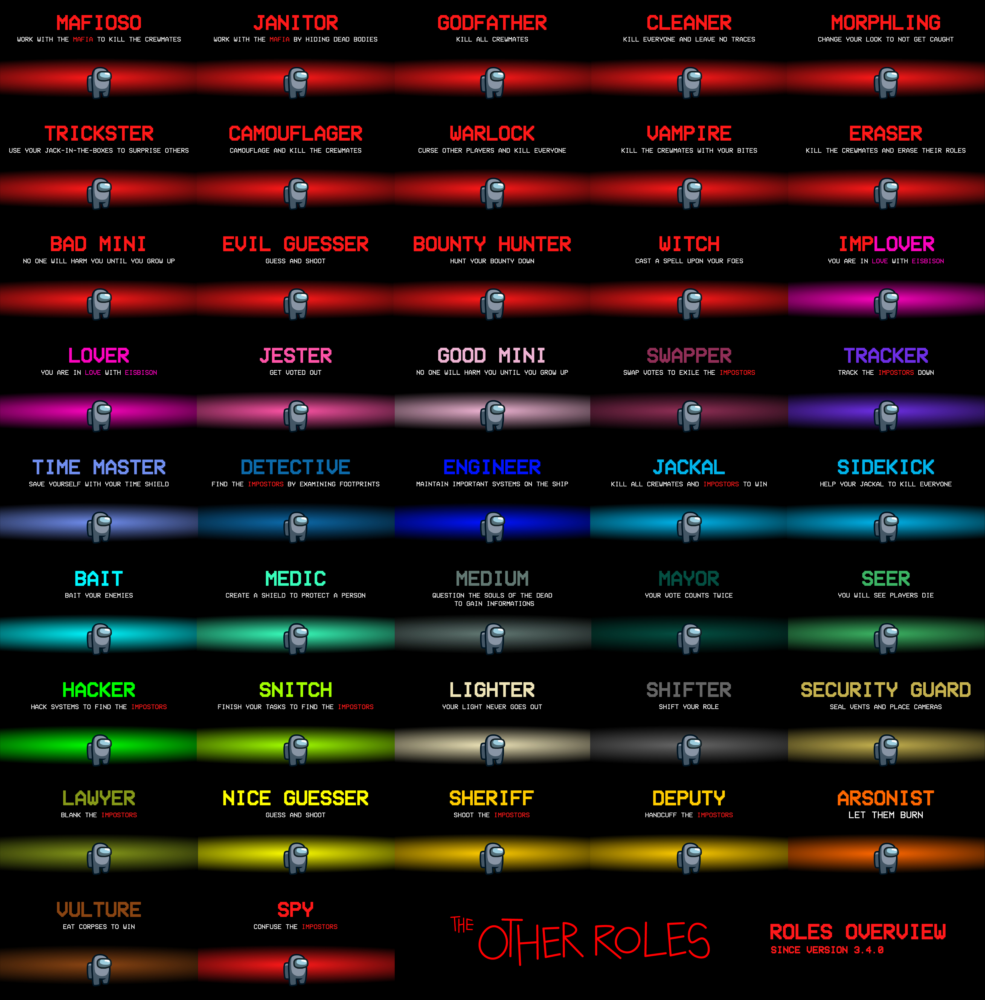

此模组不属于 Among Us 或 Innersloth LLC ，其中包含的内容并未得到 Innersloth LLC 的认可或其他方式的赞助。此处包含的部分内容为 Innersloth LLC 的财产。© Innersloth LLC.

## 前言*

标`*`的内容为译者FiveFireX(中国)所补。

## 更多职业

**更多职业**是[《Among Us》](https://store.steampowered.com/app/945360/Among_Us)的一个模组，它为游戏添加了许多新角色，新设置以及自定义帽子的支持。更多的角色即将来临，尽情期待:)

## 发行版

| Among Us 版本 | 模组版本 | 汉化版本* | 链接                                                |
| ------------- | -------- | --------- | --------------------------------------------------- |
| 2022.2.23s    | 3.4.4    | 1.0Beta   | [下载](/releases/download/v3.4.4/TheOtherRoles.zip) |

## 更新日志

  
点开查看更新日志

  <b>3.4.4 1.0Beta</b>
  <ul>
    <li>修复了在官方服务器上游戏未正确结束的问题（特别感谢miniduikboot和6pak）</li>
  </ul>

## 安装

### Windows 手动安装

1. 下载并解压缩最新版本。
2. 找到游戏的根目录（可在Steam的游戏上右键跳转）。
3. 复制一份游戏副本，便于区分原版与模组。
4. 把解压缩过的最新版本放到根目录中。
5. 右键以**管理员身份**运行`Among Us.exe`文件，因体积较大，第一次启动可能会花费较长时间。

进不去？请检查是否安装依赖项目[VC_Redist](https://aka.ms/vs/16/release/vc_redist.x86.exe)！

## Linux & UNIX & macOS 手动安装（不建议，您可以使用 Windows 虚拟机）

1. 下载并解压缩最新版本。
2. 找到游戏的根目录。
3. 通过winecfg引用`winhttp.dll`，详见https://docs.bepinex.dev/articles/advanced/steam_interop.html#open-winecfg-for-the-target-game。
4. 通过 Steam 启动游戏。

## 设置

我们为Among Us添加了一些新设置（除了角色设置之外的）：

- **主播模式**：可以隐藏房间代码、自定义服务器IP与端口。通过修改`./BepInEx/config/me.eisbison.theotherroles.cfg`来显示不同的颜色与文本。
- **随时修改伪装者&地图**：现可在游戏大厅内随意更改，而不是开房间时固定设置。
- **最多会议次数**：飞船上总共可以召开的紧急会议数（仍保留每个玩家的最大会议数，但如果此项成为0，即使您剩下一些会议，也无法使用会议。市长无视此规则）。
- **隐藏玩家姓名**：顾名思义。恋人、警长警员、伪装者（含特工）或豺狼团队仍然能知道彼此，律师仍然知道委托人。所有人仍然能看到小孩的年龄。
- **允许多人同时扫描**。
- **灵魂可见每人角色**。
- **灵魂可见剩余任务**。
- **灵魂可见投票结果**。
- **使用随机地图**：在随机地图上游玩，还可以选择包含 dlekS 反转贝壳号而无需调整时间至4月1日。
- **角色摘要**：游戏结束时，将在左上角显示玩家的职业和任务（如有）。
- **显示玩家深浅**：会议中可见每人颜色深浅。

### 每张地图的任务限制

**如果配置选项高于该地图的最高可用任务数，则任务被设为最高可用任务数。**例：在贝壳号上设置4个公共任务，则每人只会接到2个公共任务。

最高可用任务数

| 地图          | 公共任务 | 短任务 | 长任务 |
| ------------- | -------- | ------ | ------ |
| Skeld 贝壳号  | 2        | 19     | 8      |
| Mira 米拉总部 | 2        | 13     | 11     |
| Polus 波鲁斯  | 4        | 14     | 15     |
| Airship 飞艇  | 2        | 23     | 15     |

## 自定义帽子

原作者将在mod中集成一些好的帽子设计（不过到现在还没有）。

*不过遵循拿来主义（doge），可以去GitHub找找现成的，我懒得码字了。

## 颜色

## 角色分配系统

mod作者仍在改进角色分配系统。尽管现在不怎么乐观，但至少比旧的好。

首先，要设置船员、中立和伪装者的角色数量，只有在游戏中有足够多的玩家，并且游戏中设置了足够多的角色（非0%），才会达到您预期的效果。然后会按如下规则生成：

1. 设置为100%的角色一定会随机分配给玩家。
2. 设置为10%到90%的角色会将1-9个变量放到组中，玩家在其中会随机选择，直到达到指定的数量。如果分配到某个职业，则该职业的所有变量将被删除（就像鱼缸一样，里面有好几组1-9条一样的鱼，你闭着眼选，选到哪条鱼，所有一样的鱼就都是你的啦）。
3. 黑手党、小孩和恋人等特殊职业不使用第二条提到的方法，而是直接独立地分配给玩家。

**举个例子**：

设置：2个特殊的船员职业，告密者100%，黑客10%，跟踪者30%。

开始：船员A将分配到告密者。船员B将会随机抽取：[黑客, 跟踪者, 跟踪者, 跟踪者]中的一个职业。

注意：如果黑客为20%，跟踪者60%，将会是一样的结果。

## 角色摘要

### 伪装者

#### 黑手党

黑手党是由三个伪装者组成的团队。

教父等于普通伪装者。

小弟在教父死前只能跳管道而不能击杀。

清理者不能击杀，但可以协助其他伪装者清理尸体。

**注意**：

- 设置3个伪装者职业才可以生成黑手党。

**游戏选项**

| 名称           | 描述 |
| -------------- | ---- |
| 黑手党生成概率 | -    |
| 清理者冷却     | -    |

#### 变形者

可以取样一个玩家，并在必要时变成他的样子。

**注意**：

- 变形者可以变成小孩。
- 黑客在地图或心电图上会看到变形后的颜色。
- 侦探在地上会看到变形后的颜色脚印（包括已经在地上的）。
- 其他伪装者视角里，变形者变形后的名字仍然是红色的。
- 医生护盾会相应地显示或者消失。
- 跟踪者和告密者的箭头不受变形影响。

**游戏选项**

| 名称           | 描述           |
| -------------- | -------------- |
| 变形者生成概率 | -              |
| 变形冷却       | -              |
| 变形持续时间   | 保持变形的时间 |

#### 隐蔽者

隐蔽者使用隐蔽技能后，所有人的帽子与皮肤等将消失，且颜色全部变为灰色。

**注意**：

- 此时的小孩外观为正常形态。
- 侦探会看到灰色脚印（包括已经在地上的）。
- 黑客只能看到灰色图标。
- 盾牌暂时消失。
- 跟踪者和告密者的箭头仍然不受影响。

**游戏选项**

| 名称           | 描述                   |
| -------------- | ---------------------- |
| 隐蔽者生成概率 | -                      |
| 隐蔽者冷却     | -                      |
| 隐蔽持续时间   | 期间玩家将保持灰色外观 |

#### 吸血鬼

可以咬其他玩家。玩家将在一定时间内速度变慢并死亡。

如果吸血鬼生成概率不等于0（即使游戏中并没有吸血鬼），所有玩家都可以放下一颗大蒜。

如果吸血鬼在大蒜范围内，吸血按钮会变成普通击杀（也可设置为不可击杀）。

**注意**：

- 如果开会时被咬的玩家还活着，他们会在会议开始时死亡。
- 吸血与普通击杀共用冷却（大蒜外咬人后，大蒜内普通击杀共用吸血冷却）。
- 如果有吸血鬼，则一定不会有男巫。

| 名称                   | 描述 |
| ---------------------- | ---- |
| 吸血鬼生成概率         | -    |
| 吸血鬼击杀延迟         | -    |
| 吸血鬼冷却             | -    |
| 吸血鬼可在大蒜附近击杀 | -    |

#### 抹除者

可以抹去任何玩家的职业。

目标将在下一次会议结束投票后、展示投票结果前被抹除职业。

每次抹除后，增加10秒冷却。

即使抹除者或目标在会议时死亡，也会执行抹除。

如果设置允许，那么可以对特工或伪装者队友进行抹除，抹除会使伪装者队友变成普通伪装者。

**注意**：

- 如果抹除小偷，小偷偷职业仍会触发。此时小偷与被偷的目标都会变成白板。
- 抹除一个恋人会自动抹除另一个恋人（正如前面所说，如果有伪装者恋人，则会变成普通伪装者）。
- 抹除豺狼会使跟班上位（如果设置允许），同样，抹除警长也会使警员上位（如果设置允许）。
- 因为玩家在被投出之前就完成了抹除，所以投出被抹除的恋人会导致另一个恋人存活，小丑的胜利也不会触发。

**游戏选项**

| 名称                 | 描述                   |
| -------------------- | ---------------------- |
| 抹除者生成概率       | -                      |
| 抹除者冷却           | 每次抹除后冷却增加10秒 |
| 抹除者可以抹除任何人 | 包括特工及伪装者队友   |

#### 魔术师

魔术师可以放置3个盒子。这些盒子对其他玩家而言是看不见的。